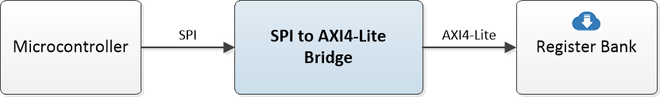

# SPI to AXI4-Lite Bridge

An SPI to AXI4-lite bridge for accessing AXI4-lite register banks, such as the ones generated by [airhdl.com](https://airhdl.com), over a serial peripheral interface (SPI).



## Using the Core

The SPI to AXI4-lite bridge comes as single, self-contained file for easy integration into your design. It is available in both **VHDL** and **SystemVerilog** versions:

* VHDL version: `/src/spi2axi.vhd`
* SystemVerilog version: `/src/spi2axi.sv`

### SPI Modes

The SPI to AXI4-Lite bridge supports all four SPI modes, as defined in the following table:

| Mode | Clock polarity (CPOL) | Clock Phase (CPHA) | Description |
| :---:| :-------------------: | :----------------: | ----------- |
| 0    | 0 | 0 | Idle clock level is `0`, data captured on leading (rising) clock edge. |
| 1    | 0 | 1 | Idle clock level is `0`, data captured on trailing (falling) clock edge |
| 2    | 1 | 0 | Idle clock level is `1`, data captured on leading (falling) clock edge. |
| 3    | 1 | 1 | Idle clock level is `0`, data captured on leading (falling) clock edge. |

Notes:

* All SPI bytes are transferred MSB-first.
* The SPI mode is configured statically using the component's `SPI_CPOL` and `SPI_CPHA` generic parameters.

### SPI Transactions

#### Write Data Transactions

Write transactions write a 32-bit data word to an AXI4-Lite register at a given address. SPI write transactions have a total length of 11 bytes. The first byte, which is the `instruction` byte, must have a value of `0x00` to initiate a write transaction. It is followed by the 4 address bytes and the 4 data bytes which are all transmitted high-byte first.

| Byte | MOSI    | MISO | Comment |
| :---: | ------- | ---- | ------- |
| 0    | `0x00` | `0x00` | Signals a write transaction |
| 1    | `address[31:24]` | `0x00` | Write address (high byte) |
| 2    | `address[23:16]` | `0x00` | Write address |
| 3    | `address[15:8]` | `0x00` | Write address |
| 4    | `address[7:0]` | `0x00` | Write address (low byte) |
| 5    | `wr_data[31:24]` | `0x00` | Write data (high byte) |
| 6    | `wr_data[23:16]` | `0x00` | Write data |
| 7    | `wr_data[15:8]` | `0x00` | Write data |
| 8    | `wr_data[7:0]` | `0x00` | Write data (low byte) |
| 9    | `don't care` | `0x00` | A dummy byte to allow writing the data word |
| 10    | `don't care` | `status` | `[2] timeout` a timeout occurred while waiting for the write response<br />`[1:0] BRESP` AXI4 write reponse (only valid when `timeout = 0`) |

AXI4 write response codes:

| BRESP[1:0] | Response | Description |
| ---------- | -------- | ----------- |
| `0b00`     | `OKAY`   | Normal access success |
| `0b01`     | `EXOKAY` | Exclusive access success |
| `0b10`     | `SLVERR` | Slave error |
| `0b11`     | `DECERR` | Decode error |

#### Read Data Transactions

Read transactions read a 32-bit data word from an AXI4-Lite register at a given address. SPI read transactions have a total length of 11 bytes. The first byte, which is the `instruction` byte, must have a value of `0x01` to initiate a read transaction. It is followed by the 4 address bytes, plus a `dummy` byte which gives time to the bridge to perform the AXI4-Lite read transaction. The read data word appears on the `MISO` line following the transmission of the `dummy` byte.

| Byte | MOSI    | MISO | Comment |
| :---: | ------- | ---- | ------- |
| 0    | `0x01` | `0x00` | Signals a read transaction |
| 1    | `address[31:24]` | `0x00` | Read address (high byte) |
| 2    | `address[23:16]` | `0x00` | Read address |
| 3    | `address[15:8]` | `0x00` | Read address |
| 4    | `address[7:0]` | `0x00` | Read address (low byte) |
| 5    | `don't care` | `0x00` | A dummy byte to allow fetching the read data word |
| 6    | `don't care` | `rd_data[31:24]` | Read data (high byte, only valid when `status[2:0] is 0b000`) |
| 7    | `don't care` | `rd_data[23:16]` | Read data (ditto) |
| 8    | `don't care` | `rd_data[15:8]` | Read data (ditto) |
| 9    | `don't care` | `rd_data[7:0]` | Read data (low byte, ditto) |
| 10   | `don't care` | `status` | `[2] timeout` a timeout occurred while waiting for the read response<br />`[1:0] RRESP` AXI4 read response (only valid when `timeout = 0`) |

AXI4 read response codes:

| RRESP[1:0] | Response | Description |
| ---------- | -------- | ----------- |
| `0b00`     | `OKAY`   | Normal access success |
| `0b01`     | `EXOKAY` | Exclusive access success |
| `0b10`     | `SLVERR` | Slave error |
| `0b11`     | `DECERR` | Decode error |

## Simulating the Core

The design verification is based on an OSVVM VHDL test suite. Running the test suite requires a VHDL-2008 capable simulator such as Aldec Riviera-Pro.

To run the test suite, execute the following commands in the simulator console:

```
cd sim
source ../lib/OsvvmLibraries/Scripts/StartUp.tcl
build ../lib/OsvvmLibraries
build ../lib/SPI
build ../RunAllTests.pro
```

## Acknowledgments

Many thanks to:

* **Jim Lewis** of [SynthWorks Design Inc.](https://www.synthworks.com/) for the OSVVM support.
* **[Sigasi](https://www.sigasi.com/)** for providing a Sigasi Studio XPRT license, which was of great help for developing the core.  
